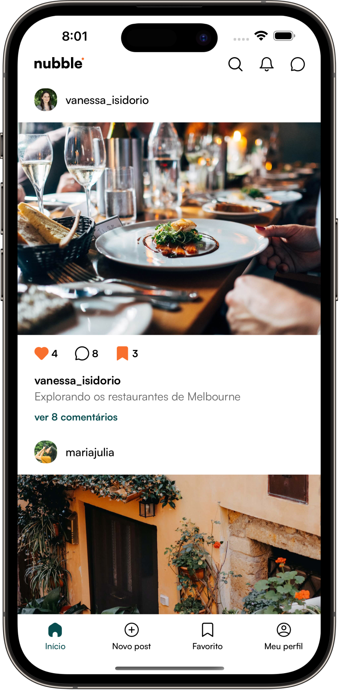
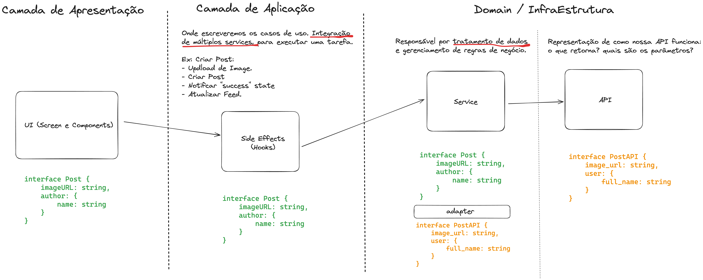

### <h2 align="center">🚧🚧🚧 App em construção 🚧🚧🚧</h2>

<h1 align="center"> Nubble App </h1>

<p align="center">
  Bem-vindo ao projeto Nubble App!<br/>
</p>

<p align="center">
  <a href="#-tecnologias">Tecnologias</a>&nbsp;&nbsp;&nbsp;|&nbsp;&nbsp;&nbsp;
    <a href="#-instalacao-do-projeto">Instalação do projeto</a>&nbsp;&nbsp;&nbsp;|&nbsp;&nbsp;&nbsp;
  <a href="#-sobre-o-projeto">Sobre o Projeto</a>&nbsp;&nbsp;&nbsp;|&nbsp;&nbsp;&nbsp;
  <a href="#-arquitetura">Arquitetura</a>&nbsp;&nbsp;&nbsp;

</p>

<p align="center">
  
</p>

## 💻 Sobre o Projeto <br id="-sobre-o-projeto">

Este projeto tem como objetivo colocar em pratica os conhecimentos adquiridos através do treinamento [PRN](https://coffstack.com.br/profissional-react-native) disponibilizado pela [Coffstack](https://coffstack.com.br). Nesse projeto coloco em pratica estudos que vão desde a criação completa de um design system completo usando a ferramenta Restyle até a implementação de testes de integração completos trazendo segurança e profissionalismo para o app. 

## 🚀 Tecnologias <br id="-tecnologias">

Esse projeto foi desenvolvido com as seguintes tecnologias:

- [React Native CLI](https://reactnative.dev/docs/getting-started-without-a-framework)
- [TypeScript](https://www.typescriptlang.org/)
- [Jest](https://jestjs.io/) e [React Native Testing Library](https://callstack.github.io/react-native-testing-library/)
- CI/CD com [GitHub Actions](https://github.com/features/actions) e em breve [Fastlane](https://fastlane.tools/)
- [React Hook Form](https://react-hook-form.com/) e [Zod](https://zod.dev/)
- [Zustand](https://zustand.docs.pmnd.rs/getting-started/introduction)
- [TanStack Query (React Query)](https://tanstack.com/query/latest)
- [React Native MMKV](https://github.com/mrousavy/react-native-mmkv)
- [Shopify Restyle](https://shopify.github.io/restyle/)
- [React Navigation](https://reactnavigation.org/)
- [EsLint](https://eslint.org/), [Prettier](https://prettier.io/) e [Husky](https://typicode.github.io/husky/)

## 🏗️ Arquitetura do Projeto <br id="-arquitetura">

O Nubble App adota uma arquitetura em camadas com princípios de Clean Architecture, SOLID, design patterns e MVVM (Model-View-ViewModel). Esta estrutura, validada em projetos com milhares de usuários, visa criar apps fáceis de entender e manter, além de escaláveis em termos de base de código e equipe.



## ⚙️ Instalação do projeto <br id="-instalacao-do-projeto">

### Passo-a-passo:

#### 1. Clone o repositório para o seu computador usando o seguinte comando:

```bash
git clone https://github.com/rogervargass/nubble-app-rn.git
```

#### 2. Navegue até o diretório do projeto:

```bash
cd nubble-app-rn
```

#### 3. Instale as dependências do projeto:

```bash
npm install
# or
yarn
```

#### 4. Inicie o Metro Server

Para iniciar o Metro, execute o seguinte comando a partir do _diretório raiz_ do seu projeto React Native:

```bash
# using npm
npm start

# OR using Yarn
yarn start
```

### 5. Inicie o app

Deixe o Metro Bundler rodar em seu _próprio_ terminal. Abra um _novo_ terminal a partir do _diretório raiz_ do seu projeto React Native. Execute o seguinte comando para iniciar seu app _Android_ ou _iOS_:

#### Android

```bash
# using npm
npm run android

# OR using Yarn
yarn android
```

#### iOS

```bash
# using npm
npm run ios

# OR using Yarn
yarn ios
```

Se tudo estiver configurado _corretamente_, você deverá ver o aplicativo rodando em seu _Emulador Android_ ou _Simulador iOS_ em breve, desde que você tenha configurado seu emulador/simulador corretamente.

## Criador do Projeto 👨‍💻 <br id="-integrantes">

<table>
  <tbody>
        <tr>
      <td align="center" valign="top" width="14.28%"><a href="https://www.github.com/rogervargass"><br /><sub><b>Roger Vargas
</b></sub></a><br /></td>
      <td align="center" valign="top" width="14.28%"><a href="https://www.github.com/LucasGarcez"><br /><sub><b>Lucas Garcez
</b></sub></a><br /></td>

  </tbody>
</table>
